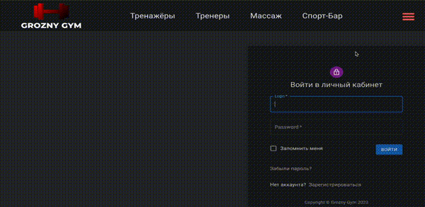
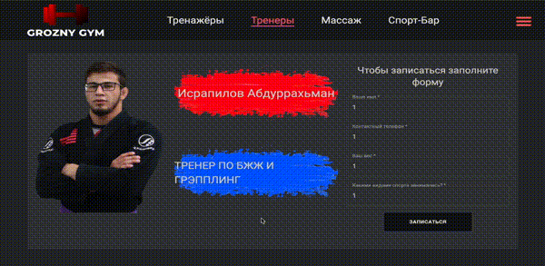

<br>

# Сайт для тренажерного зала.

## Функционал и содержание сайта:

### - Авторизация



### - Выбор тренера.



### - Что есть в зале.


### - Просмотр адреса

### - Валидация при авторизации

### - И другое

___

## Технологии проекта


<br>

___

<br>

## Команда проекта

  <a href="https://github.com/4abaev">
    
  </a>
  <a href="https://github.com/zxcviolence">
    
  </a>
  <a href="https://github.com/WetFlamer">
    
  </a>
  <a href="https://github.com/ADDIC42">
    
  </a>
  <a href="https://github.com/Duzhiev">
    
  </a>
  </a>
  <a href="https://github.com/arthurshelbaev">
    
  </a>

---

## Запуск проекта

### Перед запуском проекта в директории "backend" создать .env файл, и заполнить его по образцу существующего env.txt. Открыть терминал в "backend" и набрать

```javascript
npm i
```

```javascript
npm nodemon
```

<br>

### Затем открыть терминал в директории frontend и набрать

```javascript
npm i
```

```javascript
npm start
```

## Задачи которые я выполнял/зоны моей ответственности 
* Создал страницу тренажёров(back и front)
* Сделал админ-панель
* Возможность редактирования профиля
* Добавление товаров через админку
``` 
P.S Проект не завершён и передан в доработку. Логотип и название не настоящие
````
